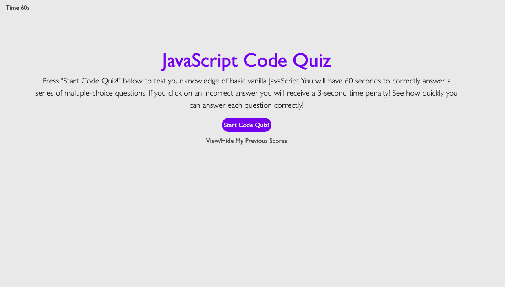
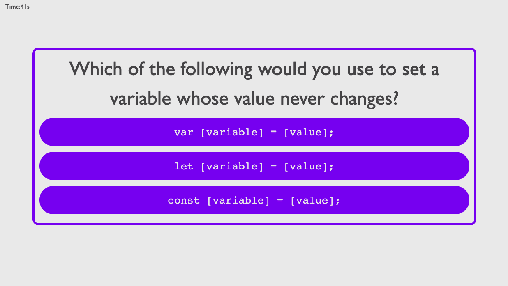
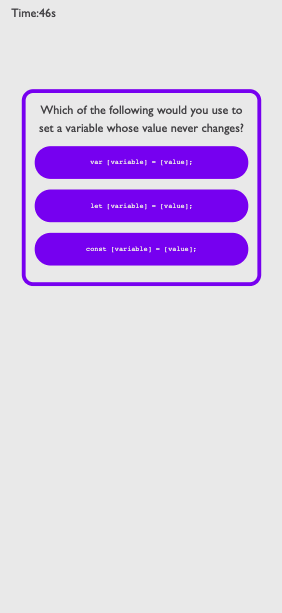

# code-quiz-game

## JavaScript Code Quiz!
This web application is pretty straightforward: the user is presented with instructions on how to complete the quiz, the user clicks the "Start Code Quiz!" button, and then the user advances by clicking on the right answer. Users have 60 seconds to complete the quiz, though there is a time penalty for clicking an incorrect answer. Once users complete the quiz, they are able to input their name and view their newest and previous scores. 

## Deployment
To visit this website, simply follow this [link](https://rflctveq.github.io/code-quiz-game/) or enter the following into your address bar: https://rflctveq.github.io/code-quiz-game/. 

## Screenshot
Here's two images of the application being run on a desktop-sized viewport: 

And here's an image of the application being run on a viewport the size of an iPhone X:

